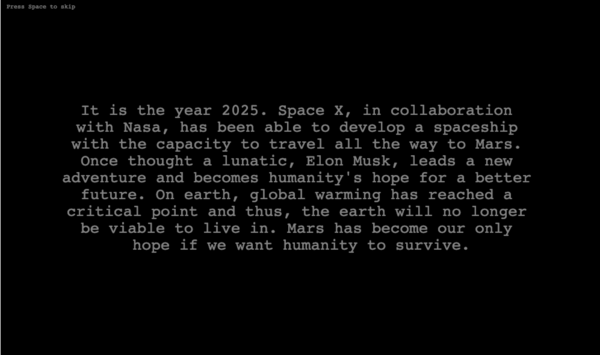
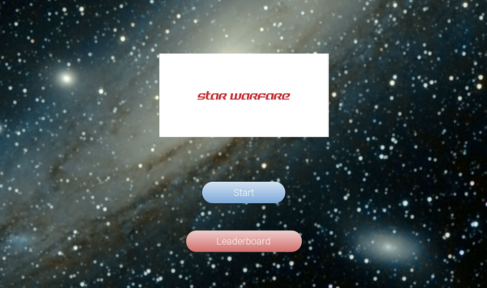
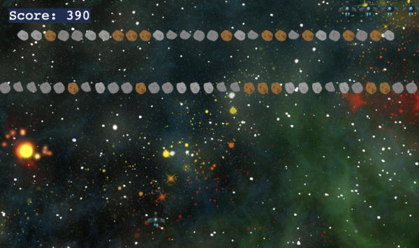
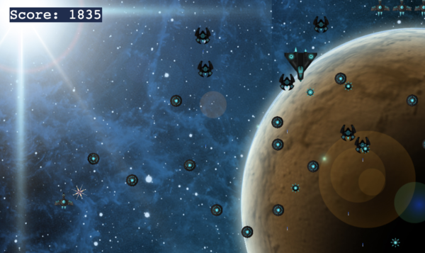
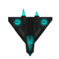

# STAR WARFARE
A JavaScript space shooting game built with Phaser 3.

## Table of Contents

* [Game Instructions](#game-instructions)
* [Live Demo](#demo)
* [Built With](#built-with)
* [Testing](#testing)
* [Design Credits](#design-credits)
* [Contributing](#contributing)
* [Acknowledgments](#acknowledgments)
* [Author](#author)
* [License](#license)

## Game Instructions

### Prerequisites

- Using NPM package and JavaScript knoledge to build and test the game.

### Installation

- Fork this repository into your own account
- Run npm install to run all of the dependencies into your local repository
- Run the command 'npm start' to start the game running into your local machine.
- Finally, open [http://localhost:3000/](http://localhost:3000/) on your browser.

### Game Concept

It is the year 2025. Space X, in collaboration with Nasa, has been able to develop a spaceship with the capacity to travel all the way to Mars. Once thought as a crazy person, Elon Musk, leads a new adventure and becomes humanity's hope for a better future. On earth, global warming has reached a critical point and thus, the earth will no longer be viable to live in. Mars has become our only hope if we want humanity to survive.
 
Elon Musk has reached out to you because of your awesome ability to procrastinate important work playing arcade games.
 
If you accept this mission, you'll lead team Mars by navigating our spaceship into the wild and dark space. Our research shows that you’ll have to fight through several obstacles to complete your mission.
 
To make things worst, Robo-Mars, the autonomous spaceship that had all of the supplies for the return journey has been hit by an asteroid, leaving supplies all over the universe. Surprisingly, they kept their position and thus your spaceship can recollect them on your way to Mars. The more supplies you capture, the more you'll be likely to have enough resources for the return trip.
 
Do you think you can lead your way into Mars?

### Main Objective

Survive as long as possible and destroy as many obstacles / enemies as you can. Try to get to mars at all costs.

### How to play

- To move the Mars spaceship you should use the 'left' and 'right' arrow keys on your keyboard.
- Accelerate by pressing the 'up' arrow on your keyboard.
- Slow down by pessing the 'down' arrow on your keyboard.
- Shoot your power gun by pressing the 'space' bar on your keyword
- Destroy obstacles or enemies in order to increase your score for the return mission.
- Avoid all obstacles to keep your team alive.

#### Marsian (The Spaceship )

- Marsian was build with the latest technology.

#### Enemies

#### Space Garbage turn into fire

- Storms are the worst. You must travel through them avoiding any mortal collision.

#### Asteroids frontiers

- Space is full of asteroids. Avoid them at all cost. 

#### Ufo

- UFO's have been detected. They seem harmful and will try to sabotage this mission as they want to conquer Mars as well.

#### Magnet

- Human garbage send into space has muted into magnetic bugs. These will feel atracted to the spaceship and make your spacecraft heavier and more prompt to collide with other space items. 

#### Trooper

- Some UFO leader has been detected, guarding Mars Orbit. They will try to destroy our ship at all cost.

## Demo

[Live Demo](https://starwarfare.netlify.app/)

## Game Development Stages

- **Day 1**
**Learn Phaser 3 module**
 I code along the Phaser 3 space shooter tutorial learning the basics about how to structure the project. I setup as well the current repo, installing Webpack and Phaser 3, thinking about the game logic. Manage to complete this steps without any problems.

- **Day 2**
**Game Design**
 Pulish the game concept, define the characters and main objective. Look for assets to implement all of the game scenes. Define the game rules and logic. Work on the storytelling to make it attractive. Plan the development of the game in specific chunks of user stories converted to technical tasks to be done. 
  - Game Concept (Done)
  - Characters (Done)
  - Main Objective (Done)
  - Define Game Logic (Done)
  - Implementation Plan (Done)
  - Define Assets (Done)

- **Day 3**
**Scene Development**
  - Implement main menu (Done. Finished on Day 4)
  - Implemente main game (Done. Finished on Day 4)

- **Day 4**
**Game Development**
  - Implement leaderboard menu (Done. Finished on day 5)
  - Implement menu (Done)

- **Day 5**
**Deployment**
  - Run tests (Done)
  - Deploy to netlify (Done)

### Retrospective:

After developing the game and looking back at the initial plan, conceived on the second day these are some reflections about my development.

What went wrong?
Overall, I assume Phaser would be easier. However, it's documentation is confusing (mixed between different versions) and not cohesive enough. This meant a lot of time was invested in googling how to work around specific things, such as animation and tweens. This was not easy at all and very time consuming. The provided examples and tutorial didn't seem enough. 

What went well?
Organizing my JS files seemed good for a quick MVP game. However, the main game file can be decoupled for future versions as the game is developed into further features. 

## Built With
- Javascript
- HTML
- Phaser 3
- Webpack
- Babel
- Leaderboard API
- JEST testing
- Netlify
- ESlint and Stylelint as linters

## Testing

- Run tests by running: `npm test` on your CL.

## Contributing

Contributions, issues and feature requests are welcome!

You can do it on [issues page](issues/).

## Acknowledgments

Audio is credited to the following authors:
- Menu song -> Epic Journey by Yung Logos
- Game song, stage 1 -> Chariots of War by Aakash Gandhi
- Final song -> Soaring High by Biz Baz Studio
- Game Over song -> No.4 Piano Journey
- Final scene photo by Nicolas Lobos from Unplash
- Game Over scene photo by Mohammad Alizade from Unplash
- Main Menu scene photo by Guillermo Ferla from Unplash

Special thanks to Microverse community:
- Ocicats team
- Daniel Santander
- Murilo Roque
- Jose Roberto Perez Jimenez

## Show your support

Give a ⭐️ if you like this project!

## Author

👤 Santiago Rodriguez
- Github: [@santiagorodriguezbermudez](https://github.com/santiagorodriguezbermudez)
- Twitter: [@srba87](https://twitter.com/srba87)
- Linkedin: [srba87](https://linkedin.com/in/srba)

## License

MIT standard license.